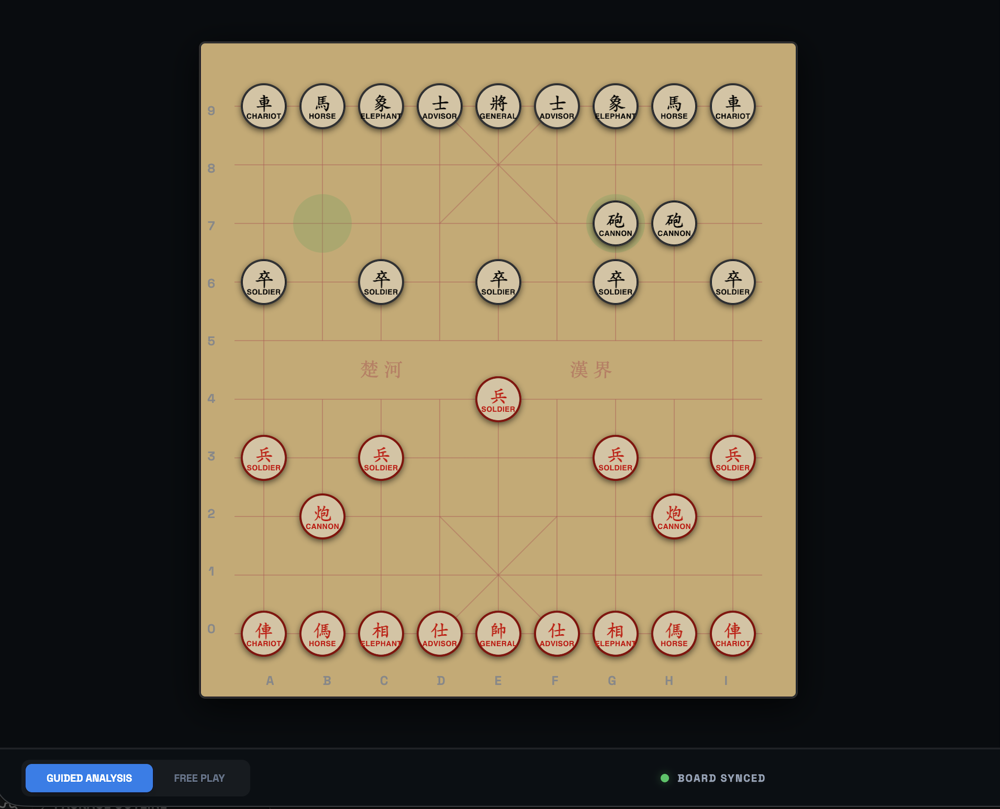
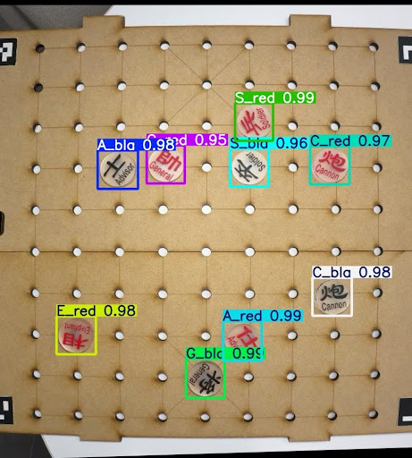
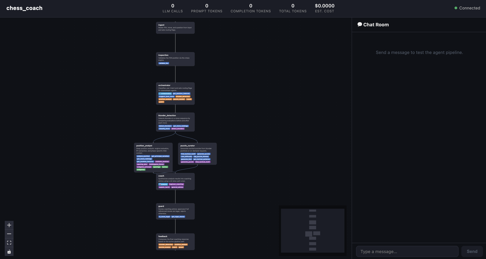
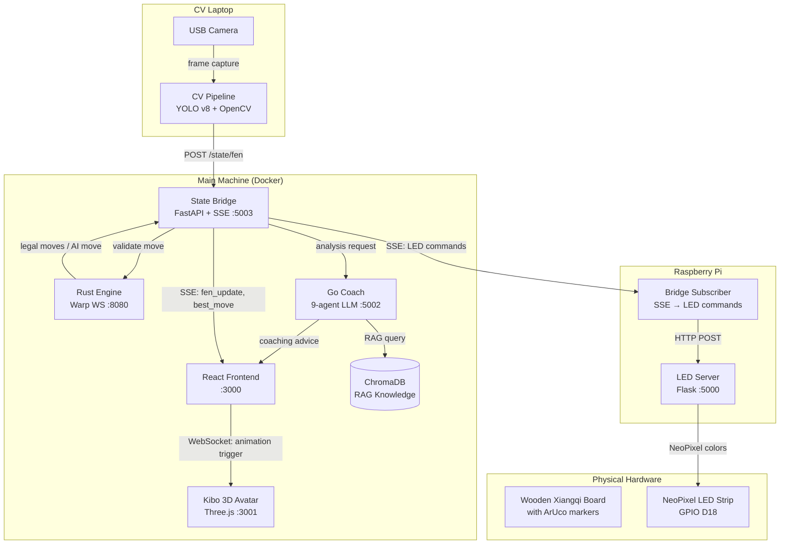

# Kibo: Guided Chinese Chess Learning

Kibo is an intelligent, multi-agent Xiangqi (Chinese Chess) ecosystem designed to bridge the gap between novice play and master-level strategy. By combining a physical LED-guided board, computer vision, and a 9-agent LLM coaching pipeline, Kibo provides the real-time, personalized mentorship usually reserved for professional studios.

**The Team:** Charlie Ai · Claire Lee · Yoyo Zhong

<p align="center">
  <video src="https://github.com/user-attachments/assets/ab392570-151c-4b86-b4c5-8f7fe031bdb8" controls width="80%"></video>
</p>

<p align="center">
  <a href="https://drive.google.com/file/d/1cGfy4v5rDAi409OZ9evruLFTVsEpsxWs/view?usp=sharing">
    
  </a>
</p>
<p align="center"><em>▶ Click to watch the board demo video</em></p>

---

## Vision

Most Xiangqi learners struggle with a "feedback gap" — they know they lost, but they don't know *why*. Kibo closes this gap by transforming every move into a learning opportunity. Through a physical-to-digital loop, Kibo detects blunders in real-time, explains complex tactical patterns through voice and 3D avatars, and generates custom puzzles based on your actual mistakes.

---

## Core Features

### The Physical-Digital Loop
- **Computer Vision:** YOLO v8 + ArUco perspective correction detects piece positions from a camera frame and exports a FEN string. No manual move entry — just press "End Turn."
- **LED Guidance:** A NeoPixel-embedded board mirrors the AI's thinking: legal moves (White), best-move suggestion (Green), AI response (Blue/Purple), blunder alert (Red).
- **Validation:** The Rust engine cross-references the CV FEN with legal moves before any state update occurs.

<p align="center">
  
</p>

### 9-Agent Coaching Intelligence
Our Go-based pipeline processes every move through three paths:
- **Blunder Guard:** Immediately halts play on moves with >150 cp loss and queues a targeted puzzle.
- **Fast Path:** Engine evaluation + principal variation returned instantly when no blunder is detected.
- **Slow Path:** Triggered by tactical patterns or large evaluation swings — an LLM Coach synthesizes a strategic explanation, verified by a Guard agent for move legality before delivery.

<p align="center">
  
</p>

### Immersive Interface
- **3D Coach Avatar:** Kibo (Three.js / Mixamo FBX) reacts to game events with trigger-mapped animations — cheering on wins, expressing frustration on blunders — driven by the state bridge's WebSocket event bus.
- **Voice Control:** Browser-native STT/TTS; wake word "Kibo" routes spoken moves to the board and questions to the coaching pipeline.
- **Plug-and-Play AI:** Ships with Mock Mode (no API key). Supports OpenRouter, OpenAI, and Anthropic via environment variable.

<p align="center">
  
</p>

---

## System Architecture



### System Architecture (as Built)

Kibo is a physical-digital hybrid with four logical layers:

| Layer | Components | Deployment |
|---|---|---|
| **CV Input** | USB camera + YOLO v8 pipeline, wooden board with ArUco markers | CV Laptop |
| **LED Control** | LED server + bridge subscriber, NeoPixel strip | Raspberry Pi 4 |
| **Game & Coaching Core** | Rust engine (rules, AI), FastAPI state bridge, Go 9-agent coach, ChromaDB RAG | Docker on main machine |
| **User Interface** | React game board, Three.js Kibo avatar, voice control | Docker on main machine |

Critical data flow:

1. User moves piece on the physical board.
2. CV laptop captures image → YOLO v8 detects pieces (ArUco markers enable perspective correction) → FEN string POSTed to State Bridge.
3. User presses **End Turn** in the React UI.
4. State Bridge validates FEN against Rust Engine. If illegal → LEDs flash red + frontend modal.
5. If legal → board state updated → SSE broadcasts to React UI and Bridge Subscriber on Pi.
6. Pi's Bridge Subscriber calls the local LED server to light up legal moves / best move / AI response.
7. Go Coach analyzes position (blunder check, tactical patterns, RAG retrieval) → returns advice to UI + Kibo animation commands.

> **Key architectural note:** The Rust Engine never directly controls LEDs. All LED commands flow through the **State Bridge → Bridge Subscriber → LED Server** sequence. This decoupling was added after initial design when we integrated the physical board.

### Architecture Evolution

Our initial design assumed the Rust Engine would speak directly to the LED board via WebSocket. During integration, we discovered that the Pi's network latency and LED driver constraints required an asynchronous, event-driven approach. We introduced the **Bridge Subscriber** (SSE client on Pi) and **LED Server** (Flask REST API) as a separate control plane. This change improved reliability and allowed the CV pipeline to run independently. The current diagram reflects this production architecture.

### Technical Stack

| Component | Technology | Responsibility |
|---|---|---|
| **Game Engine** | Rust / Warp | High-performance rules & Alpha-Beta AI |
| **Coach Pipeline** | Go / LLM Agents | 9-agent reasoning & tactical analysis |
| **State Bridge** | Python / FastAPI | Central event hub & SSE broadcaster |
| **Intelligence** | ChromaDB / RAG | Tactical knowledge & opening database |
| **Interface** | React / Three.js | 3D avatar, voice UI, and game dashboard |
| **CV Pipeline** | Python / YOLO v8 | Camera capture & FEN generation (CV laptop) |
| **LED Control** | Raspberry Pi / Flask | NeoPixel strip driven by SSE bridge events |

---

## Quick Start

### Prerequisites
- [Docker Desktop](https://www.docker.com/products/docker-desktop/) v24+
- (Optional) OpenRouter or OpenAI API key for live coaching

```bash
git clone --recurse-submodules <repo-url>
cd Capstone_Guided_Chinese_Chess
cp .env.example .env          # add API key or leave blank for Mock Mode
docker compose up --build
```

First build takes ~5 minutes (Rust compilation + ML library downloads).

| URL | What you get |
|---|---|
| http://localhost:3000 | Main game interface |
| http://localhost:3001 | Kibo 3D avatar |
| http://localhost:5002/dashboard/ | Live agent graph UI |

> **One-time knowledge base setup:** After the first build, populate the ChromaDB coaching collections. See [docs/chromadb_setup.md](docs/chromadb_setup.md).

> **Physical board (Pi):** See [docs/hardware_setup.md](docs/hardware_setup.md) for LED server, bridge subscriber, and CV pipeline setup.

---

## How a Turn Works

```
Player moves piece → presses End Turn
    │
    ├─ LEDs turn off (100 ms CV blackout)
    │
    ├─ Pi: CV captures board → YOLO v8 detects pieces → FEN generated
    │
    ├─ State Bridge validates FEN against Rust Engine legal moves
    │       │
    │       ├─ FAIL → LEDs restore, warning modal on screen → player corrects piece
    │       │
    │       └─ PASS → board state updated
    │                   └─ SSE fen_update → frontend board redraws
    │                   └─ SSE best_move  → green LED + board highlight
    │                   └─ SSE LED commands → Bridge Subscriber → LED Server → Pi LEDs
    │                   └─ AI move computed → blue/purple LED + board update
    │
    └─ Go Coach analyzes position
            │
            ├─ Blunder Detection runs first
            │       └─ BLUNDER → feedback with blunder summary only, puzzle queued
            │
            └─ No blunder → Position Analyst ‖ Puzzle Curator (parallel)
                    │
                    ├─ Fast path (no trigger) → engine eval + PV returned
                    │
                    └─ Slow path (trigger met) → Coach LLM → Guard scoring → advice returned
```

---

## 🧠 Engineering Takeaways

> Decoupling LED control from the Rust engine via an SSE subscriber on the Pi made the system more resilient to network hiccups — a design change we made mid-integration when direct WebSocket control proved unreliable under Pi load. The 6-week timeline taught us to prioritise rigorous testing where it mattered most (blunder detection, engine relay) and mock everything else (full LLM calls, CV in unit tests). Building the Go agent framework as a reusable submodule was the right call: it let us iterate on the 9-agent graph independently and will outlive this project.

---

## Future Improvements

- **Coaching:** Fine-tuned Xiangqi-specific model; cross-session player profiles; spaced repetition puzzle library
- **Physical Board:** Piece-lift detection via reed switches for zero-latency selection highlighting; improved CV robustness under variable lighting
- **Infrastructure:** Redis pub/sub for multi-session isolation; Grafana dashboard for LLM latency and blunder rates; game replay and annotated PGN export

---

## Documentation

| Document | Contents |
|---|---|
| [docs/chromadb_setup.md](docs/chromadb_setup.md) | ChromaDB knowledge base pipeline: acquire → normalize → chunk → ingest |
| [docs/hardware_setup.md](docs/hardware_setup.md) | Full Raspberry Pi setup: LED server, bridge subscriber, CV pipeline, wiring |
| [docs/bridge_server_flow.md](docs/bridge_server_flow.md) | State bridge sequence diagrams: End Turn → CV → validation → LED sync |
| [docs/agents_flow.md](docs/agents_flow.md) | 9-agent coaching pipeline: per-agent state, bridge calls, tool registry |
| [docs/led_controller_manual.md](docs/led_controller_manual.md) | LED color guide, step-by-step game sequences, troubleshooting |
| [docs/local_dev.md](docs/local_dev.md) | Running services outside Docker: Rust, Go coach, state bridge, React client |
| [docs/ports.md](docs/ports.md) | Full port mapping and all service endpoints |
| [docs/project_structure.md](docs/project_structure.md) | Full directory tree and key entry points per component |

