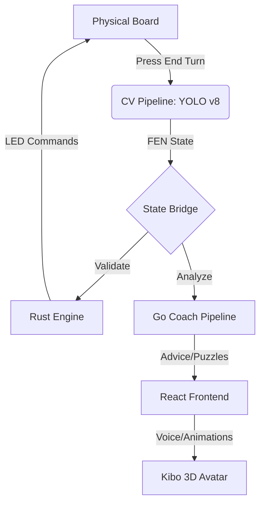
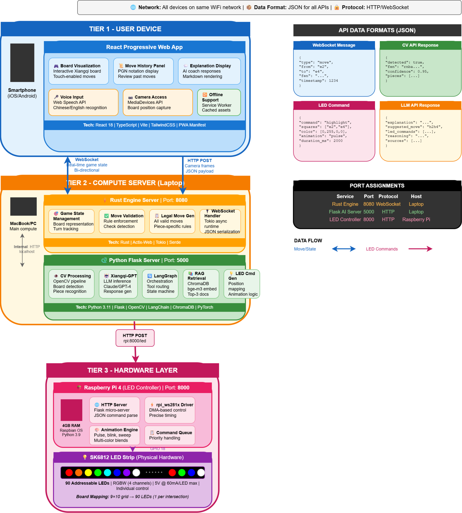

# Kibo: Guided Chinese Chess Learning

Kibo is an intelligent, multi-agent Xiangqi (Chinese Chess) ecosystem designed to bridge the gap between novice play and master-level strategy. By combining a physical LED-guided board, computer vision, and a 9-agent LLM coaching pipeline, Kibo provides the real-time, personalized mentorship usually reserved for professional studios.

**The Team:** Charlie Ai · Claire Lee · Yoyo Zhong

<p align="center">
  <video src="https://github.com/user-attachments/assets/ab392570-151c-4b86-b4c5-8f7fe031bdb8" controls width="80%"></video>
</p>

<p align="center">
  <a href="https://drive.google.com/file/d/1cGfy4v5rDAi409OZ9evruLFTVsEpsxWs/view?usp=sharing">
    
  </a>
</p>
<p align="center"><em>▶ Click to watch the board demo video</em></p>

---

## Vision

Most Xiangqi learners struggle with a "feedback gap" — they know they lost, but they don't know *why*. Kibo closes this gap by transforming every move into a learning opportunity. Through a physical-to-digital loop, Kibo detects blunders in real-time, explains complex tactical patterns through voice and 3D avatars, and generates custom puzzles based on your actual mistakes.

---

## Core Features

### The Physical-Digital Loop
- **Computer Vision (CV):** Powered by YOLO v8, Kibo identifies piece positions via camera. No manual entry required — just press "End Turn."
- **LED Guidance:** A NeoPixel-embedded board mirrors the AI's thoughts. It highlights legal moves, engine suggestions (Green), and AI threats (Blue/Purple).
- **Validation:** The Rust engine cross-references the physical state with game rules, preventing illegal moves before they happen.


<p align="center">
  
</p>

See the physical board in action: [Board demo video](https://drive.google.com/file/d/1cGfy4v5rDAi409OZ9evruLFTVsEpsxWs/view?usp=sharing).

### 9-Agent Coaching Intelligence
Kibo doesn't just play against you; it *teaches* you. Our Go-based pipeline processes every move through three distinct paths:
- **The Blunder Guard:** Immediately halts play if you make a high-loss move (>150cp), forcing a "teachable moment."
- **The Fast Path:** Provides instant engine evaluations for standard moves.
- **The Master Path:** Triggered by tactical swings or complex patterns, an LLM-led "Coach" synthesizes a strategic explanation, verified by a "Guard" agent for accuracy.
- 
<p align="center">
  <a href="https://drive.google.com/file/d/1cGfy4v5rDAi409OZ9evruLFTVsEpsxWs/view?usp=sharing">
    
  </a>
</p>
### Immersive Interface
- **3D Coach Avatar:** A Three.js animated character (Kibo) who reacts to your play — dancing for wins and providing visual cues for advice.
- **Voice Control:** Fully browser-native STT/TTS. Talk to Kibo to move pieces or ask for advice.
- **Plug-and-Play AI:** Ships with a "Mock Mode" for offline play, but supports OpenRouter, OpenAI, and Anthropic for high-level coaching.

<p align="center">
  
</p>

---

## System Architecture



### Technical Stack

| Component | Technology | Responsibility |
|---|---|---|
| **Game Engine** | Rust / Warp | High-performance rules & Alpha-Beta AI |
| **Coach Pipeline** | Go / LLM Agents | 9-agent reasoning & tactical analysis |
| **State Bridge** | Python / FastAPI | Central event hub & SSE broadcaster |
| **Intelligence** | ChromaDB / RAG | Tactical knowledge & opening database |
| **Interface** | React / Three.js | 3D avatar, voice UI, and game dashboard |
| **Hardware** | Raspberry Pi / CV | LED control & YOLO v8 piece detection |

---

## Hardware & Software Overview

<p align="center">
  
</p>

Kibo is a physical-digital system. The hardware layer is a Raspberry Pi running on the same network as the main machine; the software layer runs entirely in Docker on any laptop or desktop.

### Hardware Components

| Component | Details |
|---|---|
| **Raspberry Pi 4** | Hosts the LED server (`:5000`), bridge subscriber, and CV pipeline |
| **NeoPixel GRBW Strip** | 400 individually addressable LEDs embedded beneath the board, wired to GPIO D18 |
| **USB / CSI Camera** | Aimed at the board; feeds frames to YOLO v8 for piece detection |
| **Xiangqi Board** | Physical 9×10 board with ArUco marker corners for perspective correction |
| **End Turn Button** | GPIO button on the Pi that triggers a CV capture and sends the new state to the bridge |

### Software Components

| Component | Technology | Role |
|---|---|---|
| **Rust Engine** | Warp / WebSocket | Authoritative game logic: rule enforcement, Alpha-Beta AI, FEN validation |
| **State Bridge** | Python / FastAPI | Central event hub; relays board state to the frontend, LED board, and coach via SSE |
| **Go Coach** | Go / 9-agent LLM graph | Blunder detection, tactical analysis, puzzle generation, LLM coaching synthesis |
| **React Client** | React / TypeScript | Game board UI, chat panel, voice control, and agent inspector |
| **Kibo Avatar** | Three.js / GLTF | Animated 3D coach; reacts to game events; driven by animation command broadcasts |
| **ChromaDB** | ChromaDB v2 / HTTP | Vector store hosting four Xiangqi knowledge collections |
| **Embedding Service** | Python / sentence-transformers (`BAAI/bge-m3`) | Converts text queries to dense vectors for RAG retrieval |
| **CV Pipeline** | Python / YOLO v8 + OpenCV | Detects piece positions from camera frames; exports board state as a FEN string |
| **LED Board Driver** | Python / Adafruit NeoPixel | Translates SSE events from the bridge into NeoPixel color commands |

---

## Knowledge Base & ChromaDB Migration

<p align="center">
  
</p>

The Go coaching pipeline retrieves Xiangqi knowledge from four ChromaDB vector collections: `openings`, `tactics`, `endgames`, and `beginner_principles`. These collections must be populated before the coaching service can return strategy explanations.

### Collections

| Collection | Content |
|---|---|
| `openings` | Opening theory, system names, opening principles |
| `tactics` | Tactical patterns: clearance, fork, pin, dislodge, discovered check |
| `endgames` | Endgame patterns, checkmate constructions, practical motifs |
| `beginner_principles` | General principles, proverbs, piece values, phase advice |

### Prerequisites

- Python 3.10+ with `pip`
- ChromaDB and embedding service running (included in `docker compose up`)

### Step 1 — Create the virtual environment

```bash
cd server/web_scraper/knowledge
python3 -m venv .venv
source .venv/bin/activate
pip install -r requirements.txt
```

### Step 2 — Acquire raw HTML sources

`acquire.py` fetches all source URLs defined in `sources.yaml` and writes raw HTML to `raw/`.

```bash
# Fetch Wave 1 sources (main knowledge corpus)
python acquire.py --wave 1

# Re-fetch sources whose URLs were corrected (safe to run again)
python acquire.py --wave 1 --force
```

### Step 3 — Run the full pipeline

`run_pipeline.sh` chains all four stages: acquire → normalize → chunk → ingest.

```bash
# Full pipeline with defaults (Wave 1, ChromaDB at localhost:8000)
./run_pipeline.sh

# Custom ChromaDB or embedding URL
CHROMADB_URL=http://localhost:8000 EMBEDDING_URL=http://localhost:8100 ./run_pipeline.sh

# Force re-run all stages even if outputs already exist
./run_pipeline.sh --force

# Dry run — acquire + normalize + chunk only, skip ChromaDB write
./run_pipeline.sh --dry-run
```

Or run the stages individually:

```bash
# 1. Normalize raw HTML → cleaned text
python normalize.py

# 2. Chunk cleaned text into overlapping passages
python chunk.py

# 3. Export chunks to JSON (builds json/knowledge_base.json)
python export_json.py

# 4. Embed and upsert into ChromaDB
python populate_chromadb.py

# Force-repopulate (clears existing data and re-ingests)
python populate_chromadb.py --force
```

### Step 4 — Validate the migration

```bash
python validate_chromadb_collections.py \
  --chromadb-url http://localhost:8000 \
  --embedding-url http://localhost:8100 \
  --output-prefix chromadb_validation_latest
```

Reports are written to `manifests/chromadb_validation_latest.json` and `manifests/chromadb_validation_latest.md`. Expected collection sizes after a full Wave 1 ingest: `openings`≈111, `tactics`≈31, `endgames`≈80, `beginner_principles`≈199.

---

## 🎮 Quick Start

### Prerequisites
- [Docker Desktop](https://www.docker.com/products/docker-desktop/) v24+
- (Optional) OpenRouter or OpenAI API Key for advanced coaching

### Launch (Mock Mode)
Run the entire system locally without an API key:

```bash
git clone <repo-url>
cd Capstone_Guided_Chinese_Chess
cp .env.example .env
docker compose up --build
```

> **First-time setup:** After `docker compose up --build` completes, populate the coaching knowledge base by following the [Knowledge Base & ChromaDB Migration](#knowledge-base--chromadb-migration) guide. The game runs without it, but coaching explanations will be unavailable until the collections are loaded.

### Access the Ecosystem

| URL | What you get |
|---|---|
| http://localhost:3000 | Main Game UI |
| http://localhost:3001 | 3D Avatar View |
| http://localhost:5002/dashboard/ | Intelligence Dashboard |

If you want a quick product walkthrough before running the full stack, watch the [board working demo](https://drive.google.com/file/d/1cGfy4v5rDAi409OZ9evruLFTVsEpsxWs/view?usp=sharing).

---

## 📖 Deep Dive: The Turn Lifecycle

When a player moves a physical piece and hits **End Turn**:

1. **Vision:** YOLO v8 captures the board, generating a FEN string.
2. **Verification:** The Rust Engine ensures the move is legal. If not, LEDs flash red and the UI blocks the turn.
3. **Analysis:** The Go Coach checks for a blunder. If detected, it skips deep analysis and immediately generates a "Fix this move" puzzle.
4. **Synthesis:** If the move is tactical, the Position Analyst identifies patterns (pins, forks). The Coach Agent drafts an explanation, and the Guard Agent verifies that no illegal moves were suggested.
5. **Feedback:** Kibo (the avatar) emotes, the voice synthesizes the advice, and the physical board lights up the recommended "Best Move."

---

## Features

### Physical Board Integration
- **End Turn button** triggers CV camera capture — no manual move entry needed
- **Computer vision** (YOLO v8 + ArUco markers) detects piece positions and generates a FEN
- **Engine validation**: the new board state must match a legal move before anything updates
- **Validation failure modal**: if the CV FEN does not match a legal move, the frontend blocks play and prompts the player to correct the piece
- **LED guidance**: move highlights, best-move suggestions, and AI responses are mirrored on the physical board in real time

### AI Coaching — 9-Agent Pipeline (Go)

The coaching pipeline runs automatically on every End Turn. It has three output paths:

| Path | Trigger | Output |
|---|---|---|
| **Blunder abort** | Move is a blunder (>150 cp loss) | Blunder summary only; all other analysis skipped; puzzle queued for next turn |
| **Fast path** | No blunder, no coach trigger | Engine evaluation + principal variation (no LLM call) |
| **Slow path** | No blunder + coach trigger met | Engine evaluation + LLM coaching advice (approved by Guard) |

**Coach triggers** — the LLM runs only when at least one is satisfied:
- Player has made **3 or more moves** since Coach last ran
- **Evaluation swings ≥ 200 centipawns** from the previous position
- **Tactical pattern detected** (fork, pin, hanging piece, cannon threat)

| Agent | Role |
|---|---|
| **Ingest** | Parses FEN, move, and question from raw input |
| **Inspection** | Validates FEN against the engine before anything runs |
| **Orchestrator** | Classifies intent, sets routing flags, evaluates coach trigger conditions |
| **Blunder Detection** | Runs first — aborts all downstream agents if a blunder is detected |
| **Position Analyst** | Deep position evaluation; detects tactical patterns; feeds fast path |
| **Puzzle Curator** | Generates training puzzles (runs in parallel with Position Analyst) |
| **Coach** | LLM synthesis of all analysis into coaching advice (slow path only) |
| **Guard** | Scores Coach output — verifies every move in advice is legal; approves or rejects |
| **Feedback** | Assembles the final response for the appropriate path |

### Gameplay
- Full Xiangqi rule enforcement (legal moves, flying general, perpetual check/chase, stalemate)
- Alpha-Beta minimax AI opponent with configurable difficulty
- Drag-and-drop or click-to-move piece interaction on an authentic 9×10 board
- Real-time move sync over WebSocket; AI turn fires automatically after player move is accepted

### LED Board Color Guide

| Color | Meaning |
|---|---|
| Red | Selected piece |
| White | Empty legal destination |
| Orange | Capturable destination |
| Blue | Opponent / AI move origin |
| Purple | Opponent / AI move destination |
| Green | Best-move suggestion from engine |
| Yellow / Pink | Win celebration animation |

### Kibo — 3D Coach Avatar
Kibo is a digital avatar that transforms chess gameplay into a personalized, interactive experience and reflects on your progress over time, surfacing insights about your growth as a player — making every game feel like a coaching session.

- Three.js GLTF character with full animation state machine
- States: Idle · Walking · Running · Sitting · Standing · Dance
- Emotes: Wave · Jump · Yes · No · Punch · ThumbsUp
- Coaching server broadcasts animation commands when LLM output contains action keywords

### Voice Interaction
- Wake-word detection: **"Kibo"** (also accepts: Kibble, Kimbo, Kiko, Kido)
- Web Speech API STT / TTS — fully in-browser, no external service required
- Chess moves spoken aloud are sent to the board; other speech goes to the chat panel

### LLM Flexibility
- Pluggable provider: OpenRouter · OpenAI · Anthropic · Mock (offline fallback)
- Mock provider ships by default — the full pipeline runs without an API key
- Switch provider via environment variables, no code changes required

---

## Project Structure

```
Capstone_Guided_Chinese_Chess/
├── Engine/                       # Rust — game logic, AI, WebSocket server
│   └── src/
│       ├── api.rs                # Warp HTTP/WS handlers
│       ├── game.rs               # Xiangqi rules and board
│       ├── game_state.rs         # Position, history, scoring
│       └── ai/
│           └── alpha_beta.rs
│
├── server/
│   ├── state_bridge/             # Python FastAPI — central event hub
│   │   ├── app.py                # REST + SSE endpoints
│   │   ├── engine_relay.py       # Persistent WS relay to Rust engine
│   │   ├── events.py             # EventBus (SSE broadcast)
│   │   └── state.py              # In-memory GameStateBridge
│   │
│   ├── chess_coach/              # Go — 9-agent coaching pipeline
│   │   ├── cmd/main.go           # HTTP server, tool registry, graph wiring
│   │   ├── graph.go              # Agent graph definition
│   │   ├── agents/               # All 9 agent implementations
│   │   ├── engine/               # BridgeClient, WSClient, MockEngine
│   │   ├── tools/                # Engine tools, RAG tools, puzzle tools
│   │   └── skills/               # Coaching skill definitions (JSON)
│   │
│   ├── agent_orchestration/      # Python — LLM orchestration, session memory
│   │   ├── agents/               # Specialist agent implementations
│   │   └── tools/                # Engine client, RAG retriever, LLM client
│   │
│   └── embedding_service/        # Python — sentence transformer API
│
├── ledsystem/                    # Raspberry Pi — LED board driver
│   ├── led_board.py              # NeoPixel hardware layer
│   ├── led_server.py             # Flask REST API (:5000)
│   └── bridge_subscriber.py     # SSE → LED event handler
│
├── cv/                           # Computer vision — board state detection
│   └── board_pipeline_yolo8.py  # YOLO v8 + ArUco perspective warp + FEN export
│
├── client/Interface/             # React + TypeScript — board UI
│   └── src/
│       ├── components/           # Board, ChatPanel, GameOverModal, VoiceControl
│       ├── hooks/                # useGameState, useWebSocket, useVoiceCommands
│       └── pages/                # GamePage, AgentsPage
│
├── Kibo/                         # Three.js — Kibo 3D character viewer
│
├── bridge_server_flow.md         # Detailed state bridge sequence diagrams
├── agents_flow.md                # Full coaching pipeline reference
├── led_controller_manual.md      # LED board step-by-step user guide
└── docker-compose.yml            # 8-service container orchestration
```

---

## Port Mapping

| Service | Host Port | Container Port | Protocol |
|---|---|---|---|
| **chess-engine** | 8080 | 8080 | HTTP + WebSocket |
| **state-bridge** | 5003 | 5003 | HTTP (REST + SSE) |
| **go-coaching** | 5002 | 8080 | HTTP |
| **chess-coaching** | 5001 | 5000 | HTTP |
| **chromadb** | 8000 | 8000 | HTTP |
| **embedding** | 8100 | 8100 | HTTP |
| **chess-client** | 3000 / 80 | 3000 | HTTP |
| **kibo-viewer** | 3001 | 3001 | HTTP |
| **led-server** (Pi) | 5000 | — | HTTP |

### Key Endpoints

| URL | Description |
|---|---|
| `http://localhost:3000` | Main game interface |
| `http://localhost:3000/agents` | Agent pipeline inspector |
| `http://localhost:3001` | Kibo 3D avatar |
| `ws://localhost:8080/ws` | Rust engine WebSocket |
| `http://localhost:5003/state/events` | State bridge SSE stream |
| `http://localhost:5003/health` | State bridge health |
| `http://localhost:5002/dashboard/` | Go Coach live agent graph UI |
| `http://localhost:5002/dashboard/events` | Real-time SSE of agent execution |
| `http://localhost:5002/coach` | General coaching endpoint |
| `http://localhost:5002/coach/analyze` | Position analysis only |
| `http://localhost:5002/coach/blunder` | Blunder detection on a move sequence |
| `http://localhost:5002/coach/puzzle` | Puzzle generation |
| `http://localhost:5002/health` | Go coach health |
| `http://localhost:5002/metrics` | Prometheus metrics |
| `http://localhost:5001/health` | Python coach health |

---

## Setup Guide

### Prerequisites
- [Docker Desktop](https://www.docker.com/products/docker-desktop/) v24+
- Git
- (Physical board only) Raspberry Pi with NeoPixel LED strip and camera module

### 1. Clone the Repository
```bash
git clone <repo-url>
cd Capstone_Guided_Chinese_Chess
```

### 2. Configure Environment
```bash
cp .env.example .env
```

```dotenv
# LLM provider (leave blank to run in mock mode — no API key needed)
LLM_PROVIDER=openrouter
OPENROUTER_API_KEY=sk-or-...

# OR use Anthropic:
# LLM_PROVIDER=anthropic
# ANTHROPIC_API_KEY=sk-ant-...

# Embedding model for RAG (downloads on first run)
EMBEDDING_MODEL=BAAI/bge-m3
```

The app runs fully in **mock mode** without an API key — all pipeline agents execute and return canned coaching responses.

### 3. Start All Services
```bash
docker compose up --build
```

First build takes ~5 minutes (Rust compilation + ML library downloads). Subsequent starts use cached layers.

### 4. Open the App

| URL | What you get |
|---|---|
| http://localhost:3000 | Game board + chat + voice |
| http://localhost:3001 | Kibo 3D avatar |
| http://localhost:3000/agents | Live agent inspector |
| http://localhost:5002/dashboard/ | Go coaching pipeline dashboard |

### Stopping
```bash
docker compose down
```

---

## Physical Board Setup (Raspberry Pi)

### Prerequisites
- Raspberry Pi 4 (or 3B+)
- NeoPixel GRBW LED strip (400 pixels) wired to GPIO D18
- USB or CSI camera aimed at the board
- Pi and main machine on the same network

### 1. Install dependencies on the Pi
```bash
pip install flask requests adafruit-circuitpython-neopixel ultralytics opencv-python
```

### 2. Start the LED server
```bash
cd ledsystem
python led_server.py
# Runs at http://localhost:5000
```

### 3. Start the bridge subscriber
```bash
python bridge_subscriber.py \
  --bridge-url http://<main-machine-ip>:5003 \
  --led-url http://localhost:5000
```

### 4. Start the CV pipeline
```bash
cd cv
BRIDGE_URL=http://<main-machine-ip>:5003 python board_pipeline_yolo8.py
```

Once running, **End Turn** on the frontend triggers CV capture, engine validation, and LED updates automatically. See [led_controller_manual.md](led_controller_manual.md) for full LED color reference and step-by-step game sequences.

---

## Local Development (Without Docker)

### Rust Engine
```bash
cd Engine
cargo run --release
# http://localhost:8080
```

### State Bridge
```bash
cd server/state_bridge
pip install -r requirements.txt
ENGINE_WS_URL=ws://localhost:8080/ws uvicorn app:app --port 5003 --reload
```

### Go Coaching Service
```bash
cd server/chess_coach
BRIDGE_URL=http://localhost:5003 go run ./cmd/main.go
# http://localhost:8080 (coach) — use a different port locally if engine is on 8080
```

### Python Coaching Server
```bash
cd server
pip install -r requirements.txt
ENGINE_WS_URL=ws://localhost:8080/ws uvicorn app:app --port 5001 --reload
```

### React Client
```bash
cd client/Interface
npm install
npm run dev
# http://localhost:3000
```

---

## Architecture Documentation

| Document | Contents |
|---|---|
| [bridge_server_flow.md](bridge_server_flow.md) | Complete state bridge sequence diagrams: End Turn → CV → validation → LED sync, SSE event reference, engine relay patterns |
| [agents_flow.md](agents_flow.md) | Full 9-agent coaching pipeline: per-agent state reads/writes, bridge endpoint calls, tool registry, coach trigger logic |
| [led_controller_manual.md](led_controller_manual.md) | LED board hardware reference, color guide, step-by-step game sequences, troubleshooting |

---

## How a Turn Works (Physical Board)

```
Player moves piece → presses End Turn
    │
    ├─ LEDs turn off (100 ms CV blackout)
    │
    ├─ CV captures board → YOLO detects pieces → FEN generated
    │
    ├─ State Bridge validates FEN against engine legal moves
    │       │
    │       ├─ FAIL → LEDs restore, warning modal on screen → player corrects piece
    │       │
    │       └─ PASS → board state updated
    │                   └─ SSE fen_update → frontend board redraws
    │                   └─ SSE best_move  → green LED + board highlight
    │                   └─ AI move computed → blue/purple LED + board update
    │
    └─ ChatPanel sends move to Go Coach
            │
            ├─ Blunder Detection runs first
            │       └─ BLUNDER → feedback with blunder summary only, puzzle queued
            │
            └─ No blunder → Position Analyst ‖ Puzzle Curator (parallel)
                    │
                    ├─ Fast path (no trigger) → engine eval + PV returned
                    │
                    └─ Slow path (trigger met) → Coach LLM → Guard scoring → advice returned
```

---

## Future Improvements

### Coaching
- Fine-tuned Xiangqi-specific model replacing generic LLM prompting
- Cross-session player profile persistence (SQLite → cloud)
- Spaced repetition for puzzle library with difficulty ratings
- Opening explorer with ECO-style Xiangqi opening database

### Physical Board
- Piece-lift detection via reed switches or pressure sensors for automatic piece selection highlighting
- Improved CV robustness under variable lighting conditions
- Fan-out LED architecture to support larger board sizes

### Infrastructure
- Redis pub/sub for multi-session agent isolation
- Grafana dashboard for LLM latency, token usage, and blunder rates
- Mobile-responsive board layout for iPhone / iPad play
- Game replay and annotated PGN export

---

## 🛠️ Future Roadmap

- **Personalization:** Cross-session player profiles to track "Tactical Blindspots."
- **Hardware:** Pressure-sensitive board for 0-latency piece detection.
- **Knowledge:** Fine-tuning a Llama-3 model specifically on historical Xiangqi manuals.
