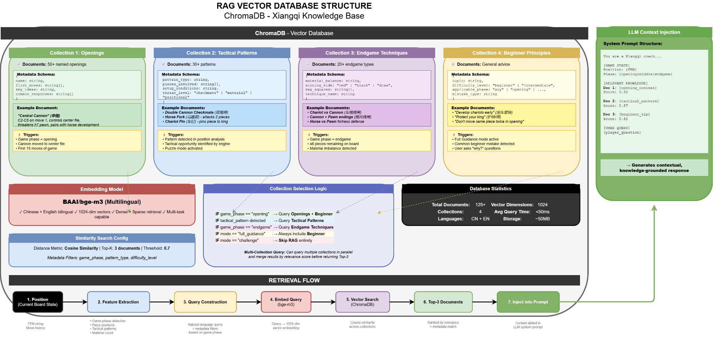

# ChromaDB Knowledge Base Setup

The Go coaching pipeline retrieves Xiangqi knowledge from four ChromaDB vector collections: `openings`, `tactics`, `endgames`, and `beginner_principles`. These collections must be populated once before the coaching service can return strategy explanations. The game runs without them, but coaching advice will be unavailable until the collections are loaded.

---

## Collections

| Collection | Content |
|---|---|
| `openings` | Opening theory, system names, opening principles |
| `tactics` | Tactical patterns: clearance, fork, pin, dislodge, discovered check |
| `endgames` | Endgame patterns, checkmate constructions, practical motifs |
| `beginner_principles` | General principles, proverbs, piece values, phase advice |

Expected sizes after a full Wave 1 ingest: `openings`≈111, `tactics`≈31, `endgames`≈80, `beginner_principles`≈199.

---

## Prerequisites

- Python 3.10+ with `pip`
- ChromaDB and embedding service running: `docker compose up --build` must have completed first

---

## Step 1 — Create the virtual environment

```bash
cd server/web_scraper/knowledge
python3 -m venv .venv
source .venv/bin/activate
pip install -r requirements.txt
```

---

## Step 2 — Acquire raw HTML sources

`acquire.py` fetches all source URLs defined in `sources.yaml` and writes raw HTML to `raw/`.

```bash
# Fetch Wave 1 sources (main knowledge corpus)
python acquire.py --wave 1

# Re-fetch sources whose URLs were corrected (safe to run again)
python acquire.py --wave 1 --force
```

---

## Step 3 — Run the full pipeline

`run_pipeline.sh` chains all four stages: acquire → normalize → chunk → ingest.

```bash
# Full pipeline with defaults (Wave 1, ChromaDB at localhost:8000)
./run_pipeline.sh

# Custom ChromaDB or embedding URL
CHROMADB_URL=http://localhost:8000 EMBEDDING_URL=http://localhost:8100 ./run_pipeline.sh

# Force re-run all stages even if outputs already exist
./run_pipeline.sh --force

# Dry run — acquire + normalize + chunk only, skip ChromaDB write
./run_pipeline.sh --dry-run
```

Or run the stages individually:

```bash
# 1. Normalize raw HTML → cleaned text
python normalize.py

# 2. Chunk cleaned text into overlapping passages
python chunk.py

# 3. Export chunks to JSON (builds json/knowledge_base.json)
python export_json.py

# 4. Embed and upsert into ChromaDB
python populate_chromadb.py

# Force-repopulate (clears existing data and re-ingests)
python populate_chromadb.py --force
```

---

## Step 4 — Validate the migration

```bash
python validate_chromadb_collections.py \
  --chromadb-url http://localhost:8000 \
  --embedding-url http://localhost:8100 \
  --output-prefix chromadb_validation_latest
```

Reports are written to `manifests/chromadb_validation_latest.json` and `manifests/chromadb_validation_latest.md`.

<p align="center">
  
</p>
